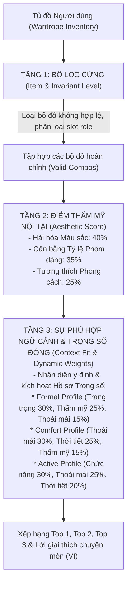

# Fashion Domain Knowledge Base & 3-Tier Scoring Engine Architecture

## 1. Mục đích & Cơ sở Khoa học (Purpose & Theoretical Foundation)

Tài liệu này chuẩn hóa toàn bộ tri thức chuyên môn ngành Dệt may - Thời trang tích hợp vào hệ sinh thái Multi-Agent Fashion Stylist.
Nhằm khắc phục triệt để các hạn chế của các hệ thống khuyến nghị thời trang truyền thống (chỉ dùng một công thức cố định hoặc phụ thuộc hoàn toàn vào black-box LLM), hệ thống áp dụng:
1. **Mô hình 5 Thuộc tính Trang phục Định lượng** (5-Dimensional Garment Profile).
2. **Kiến trúc Đánh giá Phân tầng 3 Tầng** (3-Tier Evaluation Architecture), tách biệt hoàn toàn vẻ đẹp thẩm mỹ nội tại của trang phục với sự phù hợp hoàn cảnh bên ngoài.
3. **Cơ chế Trọng số Động theo Ngữ cảnh** (Dynamic Context Weight Profiles).

---

## 2. Mô hình 5 Thuộc tính Trang phục Định lượng (5-Dimensional Garment Profile)

Mỗi món đồ trong tủ đồ số hóa (`WardrobeItem`) được chuẩn hóa và lượng hóa theo 5 chiều kích chuyên môn:

### 2.1 Mức độ Trang trọng (`formality_level`: 1 .. 5)
* **Mức 1 (Very Casual / At-home):** Đồ mặc nhà, đồ ngủ, áo ba lỗ, dép lê.
* **Mức 2 (Casual):** Áo thun cổ tròn, quần jeans rách, giày sneaker vải canvas, quần soóc dạo phố.
* **Mức 3 (Smart Casual):** Áo polo, sơ mi ngắn tay, quần kaki/chino, chân váy midi, giày lười loafer.
* **Mức 4 (Business Casual / Semi-formal):** Áo sơ mi dài tay cài nút, quần tây âu, áo blazer mỏng, giày tây/oxford hoặc cao gót cổ điển.
* **Mức 5 (Formal / Black Tie):** Bộ Comple/Suit cao cấp, tuxedo, đầm dạ hội dài, cà vạt, nơ cổ.

### 2.2 Mức độ Thoải mái & Mềm mát (`comfort_level`: 1 .. 5)
* **Mức 1 (Very Restrictive):** Đồ bó sát định hình, chất vải dày cứng không co giãn, giữ nhiệt cao (heavy wool, da cứng, áo nịt corset).
* **Mức 2 (Structured / Low Comfort):** Đồ may đo đứng form công sở, ít co giãn (áo vest dựng form, quần tây phẳng nếp, giày da đế cứng).
* **Mức 3 (Standard):** Trang phục hàng ngày có độ co giãn nhẹ hoặc phom dáng vừa vặn tiêu chuẩn (cotton thường, denim co giãn).
* **Mức 4 (Comfortable & Breathable):** Vải mềm, thông thoáng khí tốt (linen, đũi, modal, cotton xước mỏng).
* **Mức 5 (Maximum Comfort / Flowing):** Vải lụa mỏng, cotton hữu cơ siêu mềm, phom dáng bay bổng, thoáng mát tuyệt đối, không gò bó.

### 2.3 Phom dáng & Độ rộng (`silhouette_level`: 1 .. 5)
* **Mức 1 (Skinny / Tight):** Ôm sát cơ thể (áo croptop bó, quần skinny, legging).
* **Mức 2 (Slim Fit):** Ôm vừa vặn theo đường nét cơ thể.
* **Mức 3 (Regular / Straight Fit):** Phom suông vừa vặn tiêu chuẩn, thẳng hàng từ hông/vai xuống.
* **Mức 4 (Loose / Relaxed Fit):** Phom rộng thoải mái, phóng khoáng.
* **Mức 5 (Oversized / Baggy):** Phom cực rộng, thùng thình, thụng sâu (phong cách hip-hop, streetwear oversized).

### 2.4 Chiều dài Trang phục (`length`)
* **Thân trên (Top):** `cropped` (ngắn ngang eo), `hip` (ngang hông - tiêu chuẩn), `long` (dài qua mông), `extra_long` (dáng dài phủ đùi).
* **Thân dưới (Bottom):** `micro` (siêu ngắn), `short` (ngang đùi), `knee` (ngang gối), `midi` (qua gối đến bắp chân), `long` (chạm mắt cá chân/trùm giày).
* **Váy/Đầm (Dress):** `mini`, `knee`, `midi`, `maxi`.

### 2.5 Nhãn Chức năng Thực tế (`functional_flags`)
Danh sách nhãn đa trị phục vụ thích ứng hoàn cảnh vận động thực tế:
* `sun`: Khả năng chống nắng (UPF, dài tay che phủ).
* `movement`: Phù hợp vận động, co giãn thoải mái, dễ bước lên xe máy/phương tiện.
* `outdoor`: Chống bám bụi, bền bỉ ngoài trời.
* `breathable`: Vải thấm hút mồ hôi, thoáng khí.
* `water_resistant`: Chống nước nhẹ, đi mưa nhỏ.
* `work`: Đạt quy chuẩn tác phong văn phòng, công sở.

---

## 3. Kiến trúc Đánh giá Phân tầng 3 Tầng (3-Tier Evaluation Architecture)

### 3.1 Tầng 1: Bộ Lọc Cứng (Item & Invariant Level)
* Đảm bảo tính toàn vẹn thời trang tối thiểu:
  * Branch A: `TOP + BOTTOM + FOOTWEAR` (+ `OUTERWEAR` / `ACCESSORY` tùy chọn).
  * Branch B: `DRESS + FOOTWEAR` (+ `OUTERWEAR` / `ACCESSORY` tùy chọn).
* Loại bỏ các món đồ đang giặt/không khả dụng (`is_active = False`).
* Giới hạn không gian tổ hợp: Tối đa 15 món đồ mỗi nhóm danh mục để kiểm soát ngân sách hiệu năng p95 < 5 giây.

### 3.2 Tầng 2: Điểm Thẩm mỹ Nội tại (Outfit Aesthetic Score)
Điểm thẩm mỹ phản ánh vẻ đẹp tự thân và tính hòa hợp thị giác của bộ trang phục, **hoàn toàn độc lập với thời tiết ngoài trời**:

$$\text{AestheticScore} = 0.40 \cdot \text{ColorHarmony} + 0.35 \cdot \text{ProportionBalance} + 0.25 \cdot \text{StyleCompatibility}$$

1. **Hài hòa Màu sắc (`ColorHarmony` - 40%):**
   * Tất cả màu trung tính (Neutral palette): `1.00`.
   * Nền trung tính + 1 điểm nhấn màu sắc: `0.95`.
   * Phối đơn sắc (Monochromatic): `0.90`.
   * Phối màu tương đồng (Analogous): `0.85`.
   * Phối màu tương phản bổ sung có neo trung tính: `0.80`.
   * Quá 3 họ màu bão hòa không có neo trung tính: Phạt điểm nặng (`0.20`).
2. **Cân bằng Tỷ lệ Phom dáng (`ProportionBalance` - 35%):**
   * *Nguyên tắc Tương phản Cân bằng:*
     * Áo ôm (`silhouette` = 1..2) + Quần suông/rộng (`silhouette` = 3..4): Điểm thưởng tỷ lệ vàng (`1.0`).
     * Áo rộng (`silhouette` = 4) + Quần vừa vặn suông nhẹ (`silhouette` = 2..3): Điểm thưởng (`1.0`).
     * Áo ngắn croptop + Quần cạp cao dáng dài (`length` = long): Điểm thưởng kéo dài chân (`1.0`).
   * *Nguyên tắc Phạt Mất cân đối:*
     * Cả trên và dưới cùng siêu thụng (`silhouette` = 5 + 5): Phạt xuống `0.55` (trừ phong cách Streetwear).
     * Cả trên và dưới cùng siêu bó sát (`silhouette` = 1 + 1): Phạt xuống `0.60` (trừ trang phục thể thao chuyên dụng).
3. **Tương thích Phong cách (`StyleCompatibility` - 25%):**
   * Thang điểm ma trận đối xứng liên tục:
     * `casual × casual = 1.0`
     * `smart_casual × formal = 0.85`
     * `casual × formal = 0.55`
     * `formal × streetwear = 0.20`

### 3.3 Tầng 3: Sự Phù hợp Ngữ cảnh & Cơ chế Trọng số Động (Context Fit & Dynamic Weights)
Điểm tổng kết cuối cùng là tích vô hướng giữa Vector Hồ sơ Trọng số và Vector Điểm Phù hợp Ngữ cảnh:

$$\text{FinalScore} = w_{\text{formality}} \cdot \text{FormalityFit} + w_{\text{comfort}} \cdot \text{WeatherComfortFit} + w_{\text{func}} \cdot \text{FunctionalFit} + w_{\text{aest}} \cdot \text{AestheticScore} + w_{\text{pers}} \cdot \text{PersonalPref}$$

| Hồ sơ Trọng số (Profile) | Hoàn cảnh kích hoạt tiêu biểu | $w_{\text{formality}}$ | $w_{\text{comfort}}$ | $w_{\text{func}}$ | $w_{\text{aest}}$ | $w_{\text{pers}}$ |
| :--- | :--- | :---: | :---: | :---: | :---: | :---: |
| **Formal Profile** | Hội nghị, tiệc cưới, phỏng vấn, lễ kỷ niệm | **0.30** | 0.15 | 0.20 | **0.25** | 0.10 |
| **Comfort Profile** | Cà phê dạo phố, du lịch, ngày nắng nóng oi bức | 0.10 | **0.30** (Weather: 0.25) | 0.20 | 0.15 | 0.10 |
| **Active Profile** | Chơi thể thao, đi xe máy, di chuyển ngoài trời | 0.10 | 0.25 | **0.30** | 0.15 | 0.10 |
| **Balanced Profile** | Yêu cầu chung chung không nêu rõ ưu tiên | 0.20 | 0.20 | 0.20 | 0.20 | 0.20 |

---

## 4. Kịch bản Thực nghiệm Đối chứng Tương phản (Contrastive Demonstration Scenarios)

Được tự động kiểm chứng và bảo chứng bởi bộ test tích hợp `test_contrastive_defense_demonstration_scenarios.py`:

### Kịch bản A: Tiệc cưới Trang trọng tại Khách sạn
* **Đầu vào Người dùng:** *"Tối nay tôi đi dự tiệc cưới trang trọng ở khách sạn, cần chỉn chu lịch thiệp"*
* **Hồ sơ được kích hoạt:** `weight_profile = "formal"`
* **Kết quả Xếp hạng Top 1:** Áo Suit Blazer Wool + Quần tây âu Wool + Giày da Oxford (`formality_level = 5`).
* **Lời giải thích của Stylist:** Phân tích sự lịch thiệp, đường may sắc nét chuẩn mực của bộ âu phục mang lại sự đĩnh đạc và tôn trọng tuyệt đối cho buổi tiệc trọng đại.

### Kịch bản B: Cà phê Dạo phố Ngày Nắng nóng 35 Độ
* **Đầu vào Người dùng:** *"Hôm nay trời nắng nóng 35 độ oi bức, tôi đi cà phê dạo phố ưu tiên thoải mái mát mẻ"*
* **Hồ sơ được kích hoạt:** `weight_profile = "comfort"`
* **Kết quả Xếp hạng Top 1:** Áo thun cotton trắng mát + Quần đũi linen xám + Giày sneaker canvas mềm (`comfort_level = 5`, `weather_suitability = hot/warm`).
* **Bằng chứng Toán học:** Dù bộ Suit Blazer ở Kịch bản A có điểm Thẩm mỹ (Aesthetic Score) rất cao, nhưng khi rơi vào Kịch bản B, do trọng số Thoải mái và Thời tiết chiếm tới 55% tổng điểm, bộ Suit bị phạt nặng về nhiệt lượng và độ cứng gò bó, nhường vị trí Quán quân Top 1 cho bộ đồ cotton/linen thoáng khí.
* **Lời giải thích của Stylist:** Phân tích độ thông thoáng của sợi vải tự nhiên (cotton/linen), gam màu sáng phản xạ nhiệt và sự thoải mái tối đa khi di chuyển dưới thời tiết nắng nóng.

---

## 5. Các Ràng buộc Bất biến Hệ thống (System Invariants)

1. **INVARIANT 1 (Mathematical Boundedness):** Mọi điểm thành phần và điểm tổng hợp luôn thuộc đoạn chuẩn hóa $[0.0, 1.0]$.
2. **INVARIANT 2 (Aesthetic Independence):** Điểm thẩm mỹ Tầng 2 không bao giờ bị biến động chỉ vì thông tin thời tiết ngoài trời thay đổi.
3. **INVARIANT 3 (Zero LLM Hallucination in Invariants):** LLM chỉ trích xuất từ khóa ngữ cảnh và sinh lời văn giải thích; toàn bộ logic lọc đồ, tính điểm, xếp hạng và ghép tổ hợp được thực hiện 100% bằng thuật toán toán học tất định (Deterministic Algorithm).
4. **INVARIANT 4 (Resilience & Offline Determinism):** Khi các dịch vụ bên thứ ba (Gemini API, Weather API) gặp sự cố (429 Rate Limit, Timeout), hệ thống lập tức kích hoạt Circuit Breaker chuyển sang chế độ dự phòng an toàn (Fallback Provider) mà không gây sập ứng dụng.
