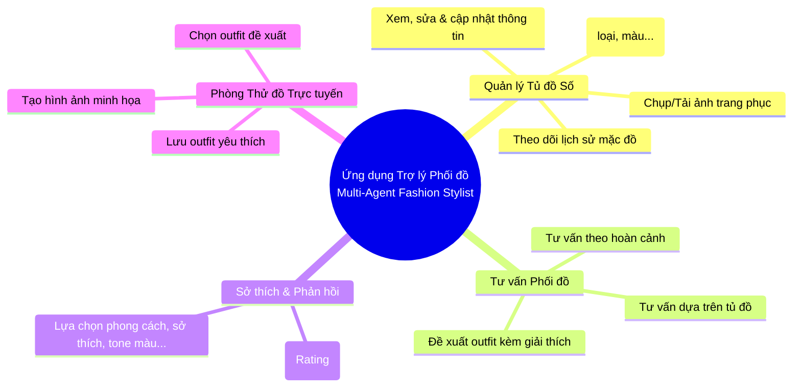
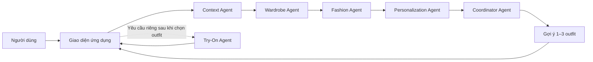
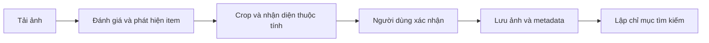
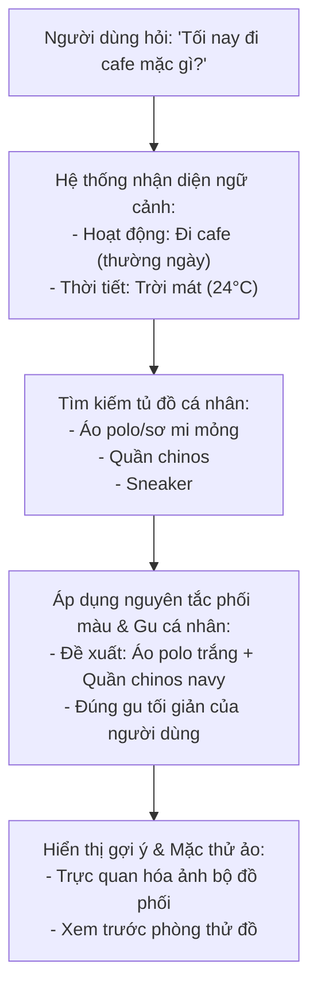

# TRỢ LÝ PHỐI ĐỒ THÔNG MINH ĐA TÁC TỬ (MULTI-AGENT FASHION STYLIST)

## CHƯƠNG 1: GIỚI THIỆU VÀ PHẠM VI ĐỀ TÀI

### 1.1. Bối cảnh và bài toán
Việc chọn trang phục mỗi ngày thường mất thời gian, đặc biệt khi người dùng muốn mặc phù hợp với hoàn cảnh, thời tiết và phong cách cá nhân. Trong khi đó, phần lớn quần áo người dùng có sẵn lại chưa được quản lý theo cách thuận tiện để dễ tìm và dễ phối.

Đề tài tập trung vào một bài toán cụ thể: xây dựng một trợ lý phối đồ biết người dùng đang có những món đồ nào và có thể dựa vào đó để đưa ra gợi ý phù hợp cho từng hoàn cảnh.

* **Khó khăn phổ biến:** Người dùng khó nhớ đầy đủ những món đồ đang có và dễ lặp lại một vài bộ quen thuộc.
* **Thiếu tính cá nhân hóa:** Lời khuyên thời trang chung thường không gắn với tủ đồ thực tế của từng người.
* **Đa dạng gu thẩm mỹ:** Sở thích giữa các người dùng khác nhau, vì vậy cùng một hoàn cảnh không nhất thiết phải có cùng một câu trả lời.

### 1.2. Mục tiêu của đề tài
* **Xây dựng tủ đồ số:** Xử lý ảnh một món, nhiều món hoặc cả outfit; cho phép người dùng xác nhận từng món trước khi lưu ảnh và metadata để tìm kiếm, phối đồ.
* **Tư vấn phối đồ theo hoàn cảnh:** Kết hợp yêu cầu của người dùng, loại sự kiện, ngày giờ, địa điểm, môi trường, thời tiết, mức độ trang trọng và thông tin từ tủ đồ để đưa ra các lựa chọn phù hợp.
* **Khai thác kiến thức thời trang:** Đưa các nguyên tắc phối màu, phong cách và mức độ trang trọng do chuyên gia cung cấp vào quá trình tư vấn.
* **Cá nhân hóa:** Bắt đầu từ các lựa chọn sở thích có sẵn và tiếp tục điều chỉnh dựa trên đánh giá 1–5 sao được hỏi thỉnh thoảng cùng lịch sử sử dụng.
* **Phòng thử đồ trực tuyến:** Giúp người dùng hình dung bộ đồ được đề xuất bằng hình ảnh minh họa.
* **Nghiên cứu kiến trúc đa tác tử:** Phân chia công việc cho các tác tử chuyên trách thay vì để một thành phần xử lý toàn bộ yêu cầu.

### 1.3. Phạm vi đề tài
Phạm vi chính của đồ án gồm: tủ đồ số cá nhân, tư vấn phối đồ, cá nhân hóa và phòng thử đồ trực tuyến. Các chức năng mua sắm và kết nối sàn thương mại điện tử không thuộc phạm vi chính của đồ án, nhưng được xem là hướng mở rộng về sau.

---

## CHƯƠNG 2: CÁC CHỨC NĂNG CỐT LÕI CỦA ỨNG DỤNG

### 2.1. Quản lý tủ đồ số
Người dùng có thể thêm quần áo bằng ảnh chụp một món, nhiều món đặt cạnh nhau hoặc ảnh một outfit. Hệ thống phát hiện vùng của từng món, cảnh báo ảnh khó xử lý và yêu cầu người dùng xác nhận hoặc chỉnh sửa trước khi lưu. Ảnh được lưu riêng tư trong kho đối tượng, còn metadata có cấu trúc được dùng để tìm kiếm. Hệ thống cũng ghi nhận lịch sử khi người dùng chủ động đánh dấu đã mặc.

### 2.2. Tư vấn phối đồ
Người dùng đặt câu hỏi về việc nên mặc gì trong một hoàn cảnh cụ thể. Hệ thống dựa trên nhu cầu, thời tiết và những món đồ đang có để đưa ra các lựa chọn phối đồ phù hợp.

### 2.3. Sở thích và phản hồi của người dùng
Người dùng lựa chọn tối đa một số phong cách, bảng màu, độ ưu tiên và những điều muốn tránh từ các option có sẵn; không bắt buộc mô tả tự do. Trong quá trình sử dụng, hệ thống chỉ thỉnh thoảng đề nghị đánh giá 1–5 sao, dự kiến sau mỗi 5–10 outfit hợp lệ, thay vì hỏi sau mọi lần. MVP không sử dụng Like/Dislike. Các lựa chọn ban đầu, rating và lịch sử đã mặc được chuyển thành trọng số có thể giải thích để tái xếp hạng các đề xuất sau.

### 2.4. Phòng thử đồ trực tuyến
Người dùng có thể chọn outfit được đề xuất để tạo hình ảnh minh họa, từ đó dễ hình dung tổng thể bộ trang phục. Các outfit yêu thích có thể được lưu lại để xem và sử dụng sau.

#### Sơ đồ tổng quan chức năng (Mindmap)

---

## CHƯƠNG 3: KIẾN TRÚC TỔNG QUAN HỆ THỐNG ĐA TÁC TỬ

### 3.1. Ý tưởng kiến trúc 
Hệ thống được tổ chức như một nhóm trợ lý chuyên trách. Trong MVP, các tác tử chạy theo một quy trình tuần tự cố định để kết quả dễ kiểm tra và tái lập. Tác tử Điều phối nằm cuối quy trình, kiểm tra các món đồ có thực sự thuộc tủ của người dùng, lưu kết quả và tổng hợp câu trả lời. Khả năng tự quyết định gọi tác tử nào được xem là hướng mở rộng sau MVP.

### 3.2. Vai trò của các tác tử

| Tác tử | Vai trò |
| :--- | :--- |
| **Coordinator Agent** | Kiểm tra tính hợp lệ, lưu các outfit đã đề xuất và tổng hợp kết quả cuối cùng. |
| **Context Agent** | Trích xuất loại sự kiện, ngày giờ, địa điểm, môi trường trong/ngoài trời, thời tiết và nguồn thời tiết, mức độ trang trọng, phong cách mong muốn và các ràng buộc trực tiếp. |
| **Wardrobe Agent** | Tìm những món đồ phù hợp trong tủ đồ số của người dùng. |
| **Fashion Agent** | Đánh giá cách kết hợp màu sắc, kiểu dáng và mức độ phù hợp với hoàn cảnh dựa trên kiến thức thời trang. |
| **Personalization Agent** | Dùng hồ sơ sở thích và phản hồi trước đây để điều chỉnh đề xuất cho từng người. |
| **Try-On Visualizer Agent** | Nhận outfit đã chọn và tạo hình ảnh minh họa để người dùng dễ hình dung. |

---

## CHƯƠNG 4: QUY TRÌNH SỐ HÓA VÀ XỬ LÝ DỮ LIỆU

### 4.1. Số hóa tủ đồ
Số hóa tủ đồ không chỉ là lưu ảnh quần áo. Mỗi món đồ cần được tách khỏi ảnh đầu vào khi có thể, được người dùng xác nhận và lưu cùng những thông tin giúp hệ thống tìm và sử dụng món đồ đó về sau.

* **Bước 1:** Người dùng tải một hoặc nhiều ảnh; ảnh có thể chứa một món, nhiều món hoặc một outfit đang mặc.
* **Bước 2:** Hệ thống đánh giá chất lượng ảnh, phát hiện vùng của từng món và tạo ảnh crop khi đủ rõ.
* **Bước 3:** Hệ thống nhận diện loại, màu sắc, chất liệu, phong cách, độ trang trọng và mức tin cậy của từng thuộc tính.
* **Bước 4:** Người dùng xác nhận, chỉnh sửa hoặc bỏ từng món được phát hiện.
* **Bước 5:** Ảnh được lưu trong object storage riêng tư; metadata được lưu có cấu trúc và lập chỉ mục tìm kiếm.
* **Bước 6:** Khi tư vấn, hệ thống trích xuất ý định tìm kiếm từ câu hỏi rồi kết hợp lọc metadata với xếp hạng để lấy các món phù hợp.

### 4.2. Hiểu yêu cầu của người dùng
Người dùng không cần nói theo một mẫu cố định. Hệ thống cần chuyển câu hỏi tự nhiên thành ngữ cảnh có cấu trúc gồm loại sự kiện, ngày giờ, địa điểm, môi trường, thời tiết và nguồn thông tin thời tiết, mức độ trang trọng, phong cách mong muốn và điều cần tránh. Ví dụ, với câu *“Tối nay đi cafe ngoài trời ở Đà Lạt, hơi lạnh, muốn lịch sự nhẹ”*, hệ thống phải nhận ra buổi cafe vào tối nay theo múi giờ của người dùng, ở ngoài trời, thời tiết lạnh do người dùng mô tả và mục tiêu trang trọng khoảng casual đến smart casual. Khi thiếu thông tin làm thay đổi đáng kể kết quả, hệ thống hỏi lại thay vì tự suy đoán.

### 4.3. Khai thác kiến thức từ chuyên gia thời trang
Kiến thức của giảng viên và sinh viên ngành Thời trang được dùng để xác định các tiêu chí mà một outfit nên đáp ứng. Ví dụ: cách phối màu, sự phù hợp giữa các phong cách và mức độ trang trọng theo từng hoàn cảnh. Mục tiêu là chuyển kiến thức chuyên môn thành những tiêu chí mà hệ thống có thể sử dụng khi đánh giá và lựa chọn outfit.

---

## CHƯƠNG 5: MINH HỌA CÁCH SỬ DỤNG ỨNG DỤNG

**Tình huống:** *“Tối nay tôi đi cafe, mặc gì?”*

* **Bước 1 – Người dùng đưa ra nhu cầu:**  
  Người dùng mở ứng dụng và hỏi: *“Tối nay tôi đi cafe với bạn, trời mát, nên mặc gì?”*  
  Người dùng không cần nhập thông tin theo một mẫu cố định mà có thể đặt câu hỏi tự nhiên.

* **Bước 2 – Ứng dụng xem xét nhu cầu:**  
  Ứng dụng hiểu rằng người dùng đang cần một bộ trang phục phù hợp cho một buổi đi cafe vào buổi tối. Hệ thống đồng thời xem xét những thông tin liên quan như thời tiết, hoàn cảnh sử dụng và sở thích của người dùng.

* **Bước 3 – Xem xét tủ đồ cá nhân:**  
  Hệ thống tìm những món đồ phù hợp đang có trong tủ đồ của người dùng, thay vì đưa ra những món đồ mà người dùng không sở hữu.  
  *Ví dụ: Áo polo trắng, Quần chinos xanh navy, Giày sneaker.*

* **Bước 4 – Đưa ra lựa chọn phối đồ:**  
  Ứng dụng đưa ra một số outfit phù hợp từ những món đồ tìm được và giải thích ngắn gọn vì sao lựa chọn đó phù hợp với hoàn cảnh.  
  *Ví dụ:* **Outfit 1:** Áo polo trắng + quần chinos xanh navy + sneaker. Phù hợp với không khí thoải mái của buổi cafe và thời tiết mát vào buổi tối.

* **Bước 5 – Thử đồ trực tuyến:**  
  Người dùng chọn outfit được gợi ý để xem ảnh lookbook minh họa trên người mẫu chuẩn hoặc moodboard dự phòng. Hình ảnh này hỗ trợ hình dung tổng thể nhưng không cam kết chính xác về kích thước hay phom cơ thể. Người dùng có thể lưu outfit; lời mời đánh giá chỉ xuất hiện theo chu kỳ 5–10 outfit hoặc khi người dùng chủ động mở.

---

## CHƯƠNG 6: ĐÁNH GIÁ THỰC NGHIỆM VÀ ĐỊNH HƯỚNG PHÁT TRIỂN

### 6.1. Đánh giá hệ thống
* **Chất lượng tủ đồ số:** Thông tin nhận diện có đủ và hữu ích cho việc tìm kiếm hay không.
* **Chất lượng tư vấn:** Outfit có phù hợp với hoàn cảnh, thời tiết và kiến thức thời trang hay không.
* **Độ sát với gu riêng của người dùng:** Đề xuất có thay đổi phù hợp theo sở thích và phản hồi hay không.
* **Trải nghiệm người dùng:** Người dùng có dễ quản lý tủ đồ và hiểu được gợi ý hay không.
* **Tốc độ phản hồi:** Thời gian từ lúc gửi yêu cầu đến khi nhận kết quả.

#### 6.1.1. Kết quả acceptance MVP

Đợt đánh giá ngày 17/09/2026 sử dụng ba bộ dữ liệu cố định có phiên bản: `vision-v1` (20 ảnh một món chất lượng chấp nhận được và 10 ảnh nhiều món/outfit đang mặc/lộn xộn/chất lượng thấp), `context-v1` (30 truy vấn tiếng Việt và ba hồ sơ onboarding), và `retrieval-v1` (30 truy vấn trên năm tủ đồ tổng hợp). Các phiên bản luật tương ứng là `vision-normalization-v1`, `context-rules-v1`, `metadata-v1` và `coordinator-v1.0`.

| Chỉ số | Kết quả | Mục tiêu MVP | Trạng thái |
| :--- | ---: | ---: | :---: |
| Độ chính xác category/color/formality của Vision | 100% | >= 85% | Đạt |
| F1 các trường ngữ cảnh bắt buộc | 87,33% | >= 85% | Đạt |
| Retrieval Recall@10 | 100% | >= 90% | Đạt |
| Sparse-wardrobe Precision@5 | 84,50% | >= 75% | Đạt |
| Wardrobe grounding | 100% | 100% | Đạt |
| Cross-user isolation | 100% | 100% | Đạt |
| Styling response p95 | 0,4134 giây | <= 5 giây | Đạt |
| Moodboard fallback p95 | 79 ms | <= 10 giây | Đạt |

Toàn bộ 417 kiểm thử backend, 75 kiểm thử frontend và bốn kịch bản Chromium E2E đều đạt. Kịch bản acceptance xuyên suốt bao gồm tải ảnh, xác nhận item, retrieval, chat, lưu outfit, đánh dấu đã mặc, rating theo cadence và tạo moodboard dự phòng. Giao diện trang chủ, chat và số hóa tủ đồ không tràn ngang ở viewport 375 px; kiểm tra accessibility cơ bản xác nhận nút có tên truy cập, ảnh có `alt` và điều khiển biểu mẫu có nhãn.

Các số liệu trên là kết quả offline có tính tái lập. Vision dùng ảnh tổng hợp đã version hóa cùng `fake-vision-v1`; Context dùng bộ phân tích quy tắc `deterministic-fallback-v1`; image provider bị tắt để đo nhánh moodboard. Không chạy provider AI trực tiếp trong đợt này, vì vậy kết quả không được diễn giải là độ chính xác của mô hình production và không bao gồm độ trễ mạng/provider. Báo cáo máy đọc đầy đủ được lưu tại `data/fixtures/acceptance_report_v1.json`.

### 6.2. Định hướng phát triển
* Hỗ trợ giảng viên và sinh viên ngành Thời trang trong nghiên cứu, giảng dạy và thử nghiệm các nguyên tắc phối đồ.
* Mở rộng sang các bài toán mua sắm và đề xuất sản phẩm khi phạm vi tủ đồ cá nhân đã hoàn thiện.
* Nâng cấp hình ảnh phòng thử đồ trực tuyến để người mẫu ảo hiển thị chân thực, đúng phom dáng hơn với từng người dùng.
